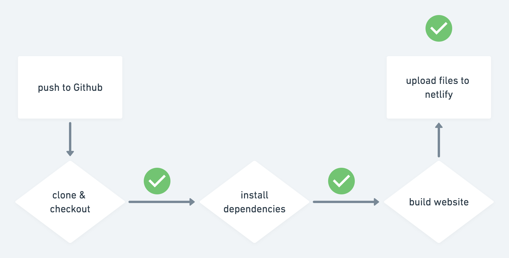

# Tutorial "Deploya tu web a Netlify usando Github actions"

en este tutorial, explico como crear un workflow en el que puedes compilar tu web hecha con gatsby y subir el resultado a Netlify todo desde Github actions!

Sigue los pasos del video para poder configurar el workflow en tu proyecto gatsby.

## Recursos

- Documentacion oficial Github Actions: https://github.com/features/actions
- GARS (documentacion Github Actions): https://gars.dev/
- VIDEO: introduccion a Github actions: <LINK_VIDEO>
- Crea tu `NETLIFY_AUTH_TOKEN` aqui: https://app.netlify.com/user/applications#personal-access-tokens

cualquier duda o consulta, escribeme por [twitter](https://hhg.link/twitter) o abre una [issue](https://github.com/horacioh/tutorial-github-actions-push-a-netlify/issues/new)!
